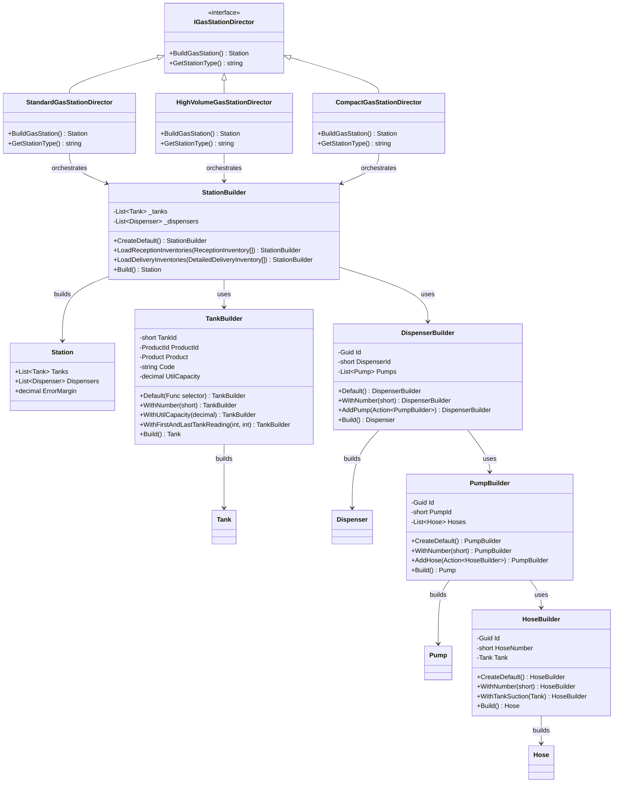
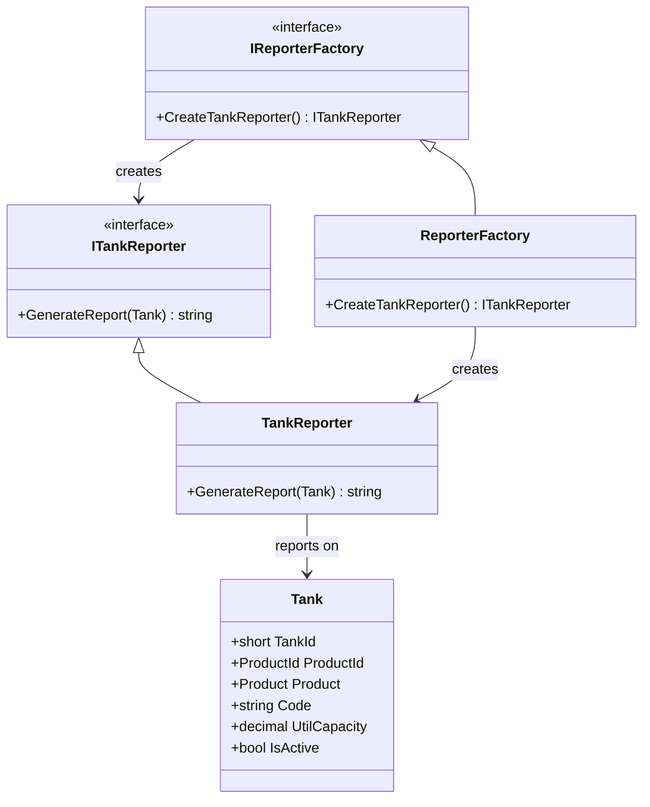
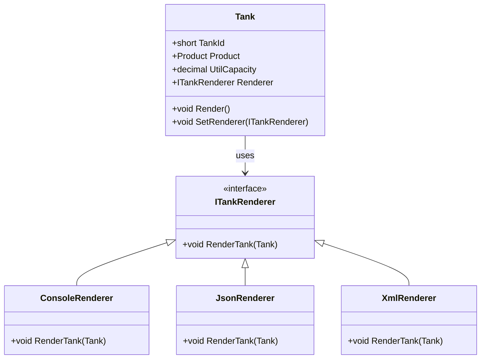
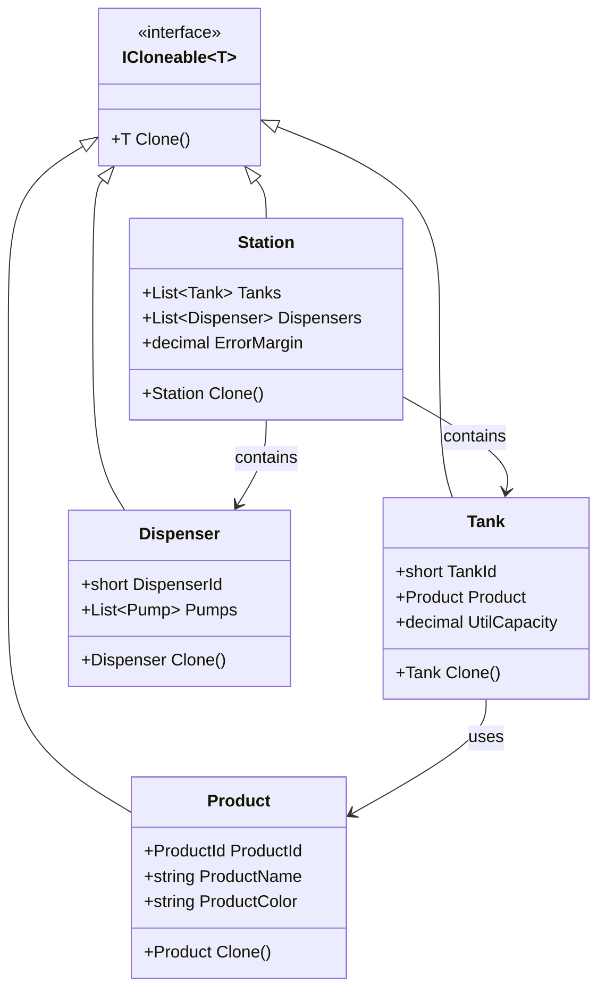
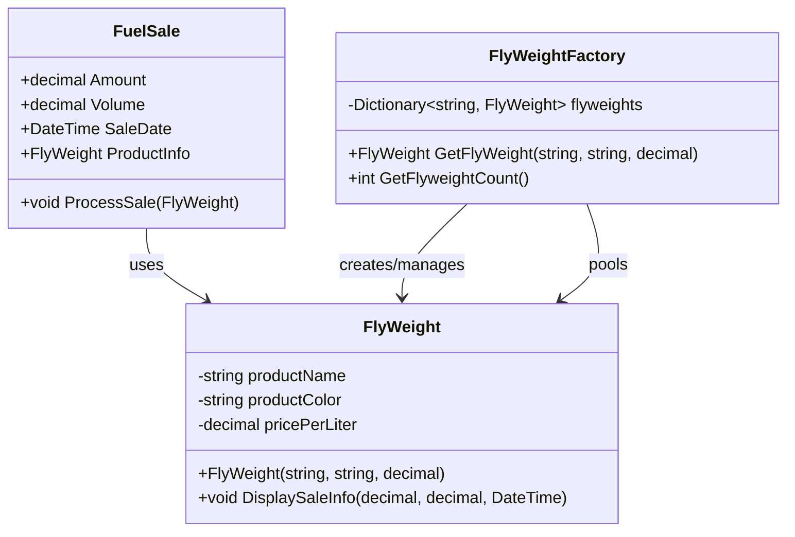
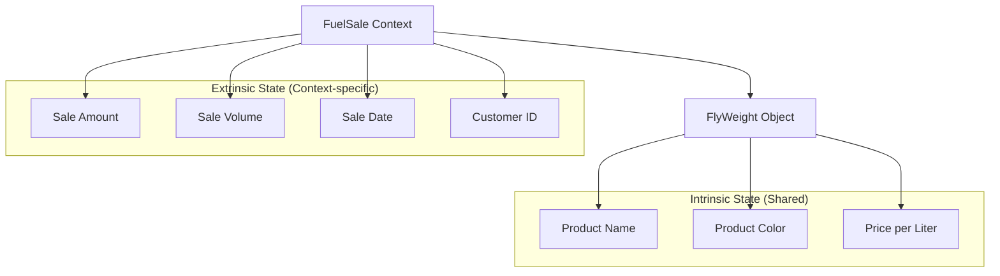

# Design Patterns Guide - OxxoGas Station Management System

This document explains the design patterns implemented in the OxxoGas Station Management System project, with diagrams based on the actual classes and interfaces in the codebase.

## Table of Contents
1. [Builder Pattern](#builder-pattern)
2. [Abstract Factory Pattern](#abstract-factory-pattern)
3. [Bridge Pattern](#bridge-pattern)
4. [Prototype Pattern](#prototype-pattern)
5. [Flyweight Pattern](#flyweight-pattern)

---

## Builder Pattern

### Concept
The Builder pattern separates the construction of complex objects from their representation, allowing the same construction process to create different representations. It's particularly useful when creating objects with many optional parameters or complex initialization logic.

### Structure in OxxoGas Project



### Key Benefits in This Implementation
- **Fluent Interface**: Each builder method returns the builder instance, enabling method chaining
- **Director Pattern**: Different directors create different station configurations (Standard, High Volume, Compact, Truck Stop)
- **Complex Object Construction**: Builds stations with tanks, dispensers, pumps, and hoses in a controlled manner
- **Flexible Configuration**: Same builders can create different station types based on director requirements

### Usage Example
```csharp
var station = new StationBuilder()
    .CreateDefault()
    .LoadReceptionInventories(receptionData)
    .LoadDeliveryInventories(deliveryData)
    .Build();
```

---

## Abstract Factory Pattern

### Concept
The Abstract Factory pattern provides an interface for creating families of related objects without specifying their concrete classes. It's useful when you need to create different variants of products that work together.

### Structure in OxxoGas Project



### Key Benefits in This Implementation
- **Family of Related Objects**: Creates reporters that work together for gas station reporting
- **Abstraction**: Client code works with interfaces, not concrete implementations
- **Extensibility**: Easy to add new reporter types (pump reporters, dispenser reporters, etc.)
- **Consistency**: Ensures all reporters follow the same creation pattern

### Usage Example
```csharp
IReporterFactory factory = new ReporterFactory();
ITankReporter tankReporter = factory.CreateTankReporter();
string report = tankReporter.GenerateReport(tank);
```

---

## Bridge Pattern

### Concept
The Bridge pattern separates an abstraction from its implementation, allowing both to vary independently. It's useful when you want to share an implementation among multiple objects or when you need to switch implementations at runtime.

### Structure in OxxoGas Project



### Key Benefits in This Implementation
- **Separation of Concerns**: Tank logic is separate from rendering logic
- **Runtime Flexibility**: Can change rendering implementation without modifying Tank class
- **Multiple Implementations**: Support for different output formats (Console, JSON, XML)
- **Extensibility**: Easy to add new rendering types without changing existing code

### Usage Example
```csharp
var tank = new Tank();
tank.SetRenderer(new JsonRenderer());
tank.Render(); // Outputs JSON format

tank.SetRenderer(new ConsoleRenderer());
tank.Render(); // Outputs to console
```

---

## Prototype Pattern

### Concept
The Prototype pattern creates new objects by cloning existing instances rather than creating them from scratch. It's useful when object creation is expensive or when you need to create objects with similar configurations.

### Structure in OxxoGas Project



### Key Benefits in This Implementation
- **Performance**: Avoid expensive object creation when cloning existing configurations
- **Template Creation**: Use existing stations as templates for new ones
- **Deep vs Shallow Cloning**: Control whether nested objects are cloned or referenced
- **Configuration Reuse**: Quickly create variations of existing station setups

### Usage Example
```csharp
// Create a prototype station
var prototypeStation = new Station 
{ 
    ErrorMargin = 0.05m,
    Tanks = existingTanks 
};

// Clone for new station
var newStation = prototypeStation.Clone();
newStation.ErrorMargin = 0.03m; // Customize as needed
```

---

## Flyweight Pattern

### Concept
The Flyweight pattern minimizes memory usage by sharing efficiently among similar objects. It separates intrinsic state (shared) from extrinsic state (context-specific) to reduce the number of objects created.

### Structure in OxxoGas Project



### Intrinsic vs Extrinsic State



### Key Benefits in This Implementation
- **Memory Efficiency**: Share product information across multiple sales
- **Reduced Object Creation**: Reuse flyweight objects for common products (Magna, Premium, Diesel)
- **Performance**: Faster object creation through object pooling
- **Scalability**: Handle thousands of fuel sales without creating thousands of product objects

### Usage Example
```csharp
var factory = new FlyWeightFactory();

// Multiple sales share the same product flyweight
var magnaSale1 = new FuelSale(50.00m, 2.22m, DateTime.Now);
var magnaSale2 = new FuelSale(75.00m, 3.33m, DateTime.Now);

// Both sales use the same Magna flyweight object
var magnaFlyweight = factory.GetFlyWeight("Magna", "Green", 22.50m);
magnaSale1.ProcessSale(magnaFlyweight);
magnaSale2.ProcessSale(magnaFlyweight);

Console.WriteLine($"Flyweights created: {factory.GetFlyweightCount()}"); // Only 1
```

---

## Design Patterns Comparison

| Pattern | Purpose | When to Use | Key Benefit |
|---------|---------|-------------|-------------|
| **Builder** | Construct complex objects step by step | Complex object creation with many parameters | Readable, flexible object construction |
| **Abstract Factory** | Create families of related objects | Need consistent object creation across product families | Ensures compatibility between related objects |
| **Bridge** | Separate abstraction from implementation | Want to vary implementation independently | Runtime implementation switching |
| **Prototype** | Create objects by cloning existing instances | Expensive object creation or template-based creation | Performance improvement through cloning |
| **Flyweight** | Share objects efficiently to save memory | Many similar objects with shared state | Significant memory savings |

## Project Structure Benefits

The OxxoGas Station Management System demonstrates how multiple design patterns can work together:

1. **Builder + Director**: Creates complex gas stations with different configurations
2. **Abstract Factory**: Provides consistent reporting across different station components
3. **Bridge**: Allows flexible rendering of station data in different formats
4. **Prototype**: Enables quick creation of similar station configurations
5. **Flyweight**: Optimizes memory usage for fuel sales with shared product data

This combination provides a robust, flexible, and efficient system for managing gas station operations while demonstrating proper application of design patterns in real-world scenarios.